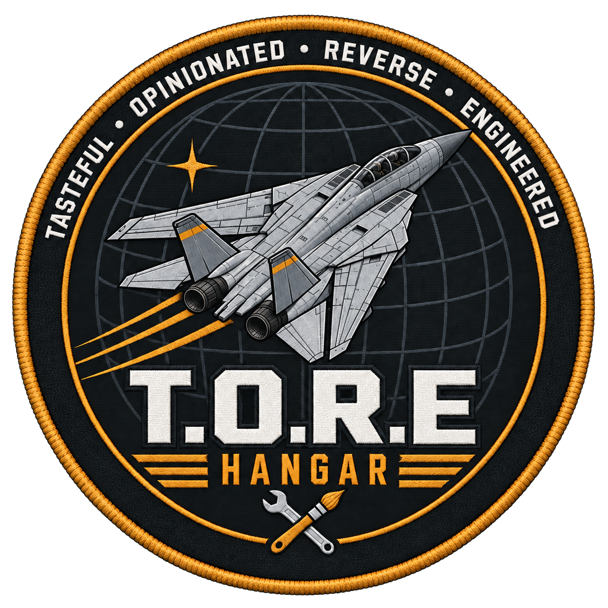

<p align="center"></p>

<h1 align="center">T.O.R.E Hangar</h1>

<p align="center">
  <a href="https://github.com/john-overton/T.O.R.E-Hangar/actions/workflows/windows.yml"></a>
  <a href="LICENSE"></a>
  <a href="docs/CHANGELOG.md"></a>
  <a href="rust-toolchain.toml"></a>
  <a href="docs/COMPATIBILITY.md"></a>
  <a href="docs/ARCHITECTURE.md"></a>
</p>

A small, standalone Rust workshop for Fighters Anthology LIB files, built toward
a Blender-light workflow for the game's models and their related resources. Native
Win32/GDI on Windows, X11/Xwayland for local Linux development. The supplied
[design system](tore-hangar-design/README.md) supplies the Gunmetal colors and
Blender-inspired workspace.

**Early working editor, not a complete SH authoring tool.** LIB and textual
BRF editing work. Aircraft geometry is edited per region where Hangar can
prove the change safe, and moving parts change only through a catalog of
same-size settings, with forms not seen in retail labelled until tested in
the game. No game data ships.

## Highlights

- Open multiple EALIB archives at once; search, inspect, add, remove, replace,
  export, copy and move resources between LIBs with reviewed dependencies.
- Edit PT/NT/JT/OT/SEE/ECM textual BRF operands in source storage units, with
  saved-vs-current values, structured groups and an envelope table.
- Graft characteristic groups from a donor definition as one undo step.
- Export an aircraft, weapon or other object with its resources into a new,
  privately named LIB.
- View SH static poses and place hardpoints. Edit Mesh selects vertices or
  faces (click, box, part) and moves, scales, deletes, flips, duplicates,
  extrudes and adds geometry on retail aircraft, region by region.
- List moving parts (gear, flaps, rudder, hook, brakes, bays, afterburner,
  swing wings, canards), preview their states, and change their gate values,
  gear swing range and direction, rotation axis and pivot.
- Paint PIC textures on the atlas or directly on the model, erase back to or
  restore the original artwork, edit palettes and UVs, and bake PNG,
  tail-number and national decals.
- Preview PCM audio and PIC images; export WAV, PNG and geometry-only OBJ.
- Lossless by default: unedited archives round-trip byte-for-byte, retail LIB
  names are protected and custom saves keep numbered backups.

The full feature list and how-to guides are in the [manual](docs/MANUAL.md).

## Download and build

### Download

[GitHub Actions](.github/workflows/windows.yml) runs only on Windows and emits
separate `tore-hangar-win98-me-pentium4` and `tore-hangar-win64` ZIP artifacts.
The legacy executable's smoke test runs on the modern Windows runner, not on
Windows 98. Source and notices are included in the repository; packages carry
the license and notices alongside the executable.

The 32-bit build targets Windows 98/ME on **Pentium 4/SSE2 or newer**. The 64-bit
build targets modern Windows. Each is a portable executable of about 1.2 MiB,
including the built-in `--smoke-test` self-check so a release build can be
checked on the target machine. Copy it to a writable location and run it. No installer or runtime
DLL is required. Windows file paths are ASCII in this first version.

**Windows 98/ME runtime compatibility remains unverified.** The executable
header and imports are audited, but an actual OS/hardware test is still
required. See [compatibility and acceptance](docs/COMPATIBILITY.md).

### Run locally on Linux

Rust 1.91.1 is pinned. Install X11 development libraries (Arch: `libx11`,
Debian/Ubuntu: `libx11-dev`) and use an X11 session or Xwayland.

```sh
cargo run --locked -- --demo
cargo run --locked -- /path/to/FA_2.LIB
cargo test --workspace --locked
cargo clippy --workspace --all-targets --locked -- -D warnings
cargo run --locked -- --smoke-test
```

PNG decoding uses the small no_std Rust crates miniz_oxide and adler2,
compiled into the executable. No Python,
Blender, OpenFA, web browser, GPU runtime or network access is needed by the
Windows editor. Python is used only for development checks.

The Linux executable also supplies a CLI; see
[Command line](docs/MANUAL.md#command-line).

### Windows builds

Both targets build on Linux without a Windows SDK, using Rust's bundled
linker and generated import libraries:

```sh
rustup target add i686-pc-windows-msvc x86_64-pc-windows-msvc
cargo build --release --locked --target i686-pc-windows-msvc
cargo build --release --locked --target x86_64-pc-windows-msvc
python3 tools/check_pe.py --legacy target/i686-pc-windows-msvc/release/tore-hangar.exe
python3 tools/check_pe.py target/x86_64-pc-windows-msvc/release/tore-hangar.exe
```

The audit also checks the embedded app icon and version resources;
`--extract-icon OUT.ico` writes the icon back out.

## Documentation

| Document | Contents |
| --- | --- |
| [Manual](docs/MANUAL.md) | Opening LIBs, workspaces, saving, CLI, export, painting, hardpoints, controls, limits |
| [Changelog](docs/CHANGELOG.md) | User-visible changes by version |
| [Architecture](docs/ARCHITECTURE.md) | Layers, format evidence, writing policy and remaining writer work |
| [Validation](docs/VALIDATION.md) | What each test build was verified against |
| [Compatibility](docs/COMPATIBILITY.md) | Platform limits and legacy acceptance still required |
| [Windows test](docs/WINDOWS-TEST.md) | Manual Windows and game acceptance checklist |
| [Design system](tore-hangar-design/README.md) | Gunmetal tokens, components and [brand voice](tore-hangar-design/BRAND.md) |

## Scope still ahead

A complete animated SH writer, new animated parts, BSP-aware placement of new faces,
topology-aware UV unwrapping, animation playback, complete runtime dependency
closure, geometric grafting, verified gameplay-unit conversions,
resizable editor splits and bitmap fonts.
There are no inactive timeline controls pretending these features work.
Current limits of the shipped tools are listed in the
[manual](docs/MANUAL.md#limits).

## Structure and provenance

`hangar-core` contains portable `no_std` + `alloc` formats and editing history.
`tore-hangar` contains shared UI logic plus small native platform backends.
[Architecture and format references](docs/ARCHITECTURE.md) records the decisions
and remaining writer work.

## License

[Third-party notices](THIRD_PARTY_NOTICES.md) covers the adapted GPL source and
DCL decoder. Code is [GPL-3.0-only](LICENSE); user-owned game content is not
included or relicensed.
